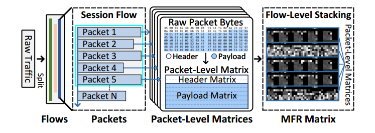

**参数**

```
[11:19:17.688840] Namespace(
    batch_size=64,
    steps=150000,
    save_steps_freq=10000,
    accum_iter=1,
    model='MAE_YaTC',
    input_size=40,
    mask_ratio=0.9,
    norm_pix_loss=False,
    weight_decay=0.05,
    lr=None,
    blr=0.001,
    min_lr=0.0,
    warmup_epochs=25,
    data_path='./data/ISCXVPN2016_MFR',
    output_dir='./output_dir',
    log_dir='./output_dir',
    device='cuda',
    seed=0,
    resume='',
    num_workers=10,
    pin_mem=True,
    world_size=1,
    local_rank=-1,
    dist_on_itp=False,
    dist_url='env://',
    distributed=False
)
```

**数据**

```
[11:19:17.726307] Dataset ImageFolder
    Number of datapoints: 2273
    Root location: ./data/ISCXVPN2016_MFR\train
    StandardTransform
Transform: Compose(
               Grayscale(num_output_channels=1)
               ToTensor()
               Normalize(mean=[0.5], std=[0.5])
           )

[11:19:17.727723] Sampler_train = <torch.utils.data.distributed.DistributedSampler object at 0x000002B8B9549C10>
```

**模型**

```
[11:19:19.016228] Model = MaskedAutoencoder(
  (patch_embed): PatchEmbed(
    (proj): Conv2d(1, 192, kernel_size=(2, 2), stride=(2, 2))
  )
  (blocks): ModuleList(
    (0-3): 4 x Block(
      (norm1): LayerNorm((192,), eps=1e-06, elementwise_affine=True)
      (attn): Attention(
        (qkv): Linear(in_features=192, out_features=576, bias=True)
        (attn_drop): Dropout(p=0.0, inplace=False)
        (proj): Linear(in_features=192, out_features=192, bias=True)
        (proj_drop): Dropout(p=0.0, inplace=False)
      )
      (drop_path): Identity()
      (norm2): LayerNorm((192,), eps=1e-06, elementwise_affine=True)
      (mlp): Mlp(
        (fc1): Linear(in_features=192, out_features=768, bias=True)
        (act): GELU(approximate='none')
        (fc2): Linear(in_features=768, out_features=192, bias=True)
        (drop): Dropout(p=0.0, inplace=False)
      )
    )
  )
  (norm): LayerNorm((192,), eps=1e-06, elementwise_affine=True)
  (decoder_embed): Linear(in_features=192, out_features=128, bias=True)
  (decoder_blocks): ModuleList(
    (0-1): 2 x Block(
      (norm1): LayerNorm((128,), eps=1e-06, elementwise_affine=True)
      (attn): Attention(
        (qkv): Linear(in_features=128, out_features=384, bias=True)
        (attn_drop): Dropout(p=0.0, inplace=False)
        (proj): Linear(in_features=128, out_features=128, bias=True)
        (proj_drop): Dropout(p=0.0, inplace=False)
      )
      (drop_path): Identity()
      (norm2): LayerNorm((128,), eps=1e-06, elementwise_affine=True)
      (mlp): Mlp(
        (fc1): Linear(in_features=128, out_features=512, bias=True)
        (act): GELU(approximate='none')
        (fc2): Linear(in_features=512, out_features=128, bias=True)
        (drop): Dropout(p=0.0, inplace=False)
      )
    )
  )
  (decoder_norm): LayerNorm((128,), eps=1e-06, elementwise_affine=True)
  (decoder_pred): Linear(in_features=128, out_features=4, bias=True)
)
```

**过程**

```
[11:19:19.022610] base lr: 1.00e-03
[11:19:19.022610] actual lr: 2.50e-04
[11:19:19.022610] accumulate grad iterations: 1
[11:19:19.023673] effective batch size: 64
[11:19:19.023673] AdamW (
Parameter Group 0
    amsgrad: False
    betas: (0.9, 0.95)
    capturable: False
    differentiable: False
    eps: 1e-08
    foreach: None
    fused: None
    lr: 0.00025
    maximize: False
    weight_decay: 0.0

Parameter Group 1
    amsgrad: False
    betas: (0.9, 0.95)
    capturable: False
    differentiable: False
    eps: 1e-08
    foreach: None
    fused: None
    lr: 0.00025
    maximize: False
    weight_decay: 0.05
)
```

**数据处理**



多层次流表示（Multi-Level Flow Representation, MFR）矩阵是YaTC交通分类器的核心创新之一。MFR矩阵通过多层次信息表示，将原始流量数据组织成一个格式化的二维矩阵。构造过程如下：

1. **流量划分**：
   - 根据IP地址、端口号和协议类型将原始流量划分为多个流（flow）。

2. **预处理**：
   - 移除以太网头部，端口号设为零，IP地址替换为随机地址但保留其方向，避免引入偏差。

3. **分割数据包**：
   - 捕获流中的M个相邻数据包，将其格式化为大小为H × W的二维矩阵，作为该流的表示。

4. **层次化信息表示**：
   - **字节级别**：每行表示一种类型的流量字节，分为头部行和有效载荷行。
   - **数据包级别**：每个数据包由头部矩阵和有效载荷矩阵表示，形成大小为H/M × W的数据包级矩阵。
   - **流级别**：流由有序的数据包组成，M个相邻的数据包级矩阵在第二维度上堆叠，形成最终的MFR矩阵。

5. **具体参数设置**：
   - MFR矩阵包含5个数据包级矩阵，共40行，每行40字节。
   - 每个数据包的头部由2行头部行（共80字节）表示，能够容纳IP层头部（20字节）、TCP头部（20字节）或UDP头部（8字节）及可选头部。
   - 分配6行有效载荷行来容纳每个数据包的有效载荷，当超过240字节时进行截断。
   - 如果有效字节数不足，则用0字节填充，以形成固定大小的表示矩阵。

这种设计保证了各层次信息的固定性，避免了低层次信息溢出导致的高层次信息丢失，使得MFR矩阵能够有效地表示原始流量。

**训练策略**


- 预训练不需要昂贵的人工标记，允许使用来自真实场景的大量未标记数据。此外，我们发现一个非常高的掩模比（90%）在下游任务上取得了更好的结果。高掩码比率也意味着只有少数补丁可见，导致缺乏原始信息来捕获包内和包之间的依赖关系。因此，我们在预训练中执行全局注意，而不是包级注意和流级注意。复杂的预训练任务和全局关注使得流量编码器能够以最少的信息捕获包级和流级的特征。
- 为了加快收敛速度并减小模型尺寸，受到ALBERT (Lan et al 2020)和CYCLE (Takase and Kiyono 2021)的启发，我们在两个流量编码器之间共享参数，并在参数数量减半的情况下获得更好的性能。我们认为包级注意和流级注意本质上都是在执行补丁间的依赖捕获，并且多头自注意期间的信息交互是相似的。而且，同一行patch中的数据属于同一类型，即header或payload, row pooling的平均操作不会改变patch所在的特征空间。因此，除了粒度不同外，两种流量编码器在特征空间上与变压器层的叠加非常相似，这为参数共享的应用提供了条件。在微调阶段，与预训练阶段相比，两个流量编码器导致Transformer层的深度增加了一倍，但训练数据量非常有限。因此，参数共享也使得模型更容易训练。

**预训练**

- 对MFR进行90%的遮挡
- 交给encoder进行token的嵌入，然后再通过decoder进行恢复
- 这里的注意力机制使用的是全局attention
- 使用的是未标记的数据
- 损失函数：均方误差MSE

**微调**

- 不遮挡，将每一个MFR矩阵分为五个patch
- 连续经过两个encoder
    - 第一个：包级attention + 行池化
    - 第二个：流级attention + 列池化
- 再经过线性层进行低纬度映射
- 再MLP进行分类
- 损失函数：交叉熵CE

**补充**

- 原文讨论部分
- 模型本身
- 将transformer放到vit下面
- 迁移学习
- Adamw和权重衰减
- 学习率策略
- 数据增广

