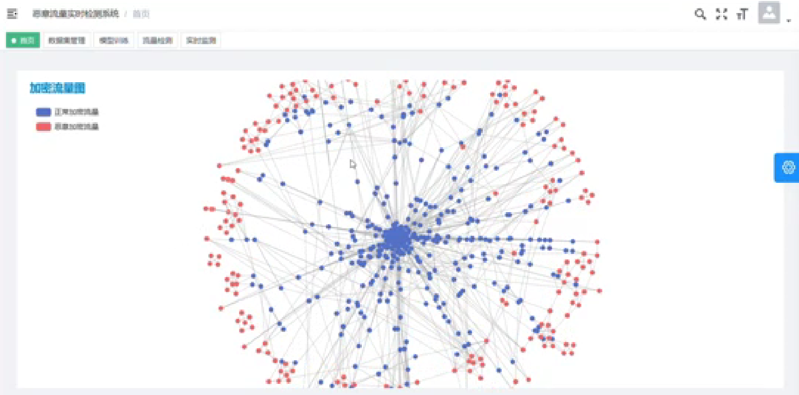
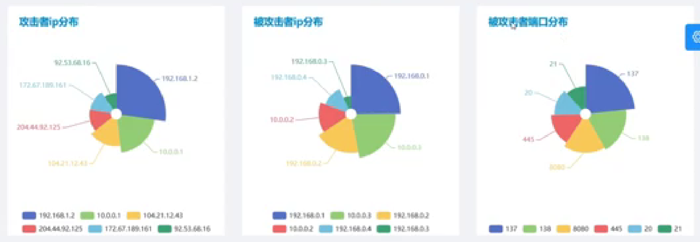
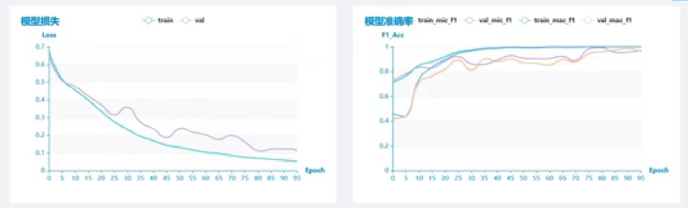
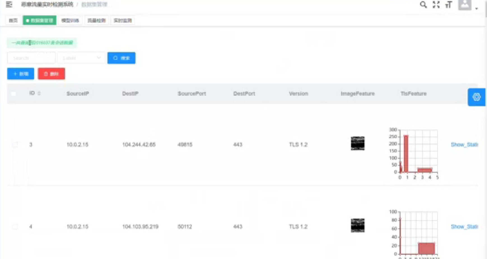
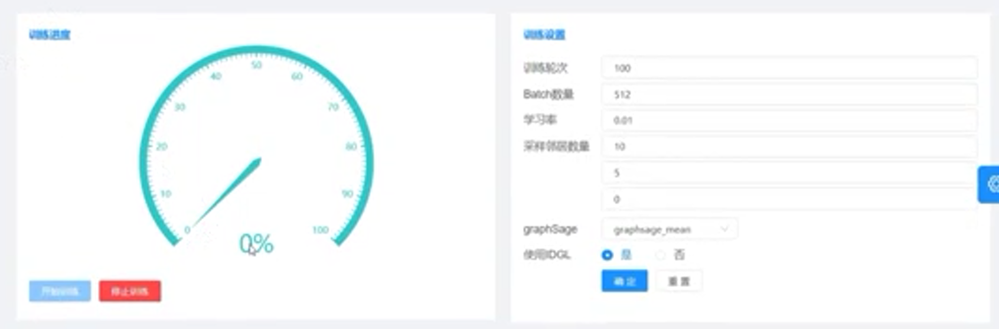
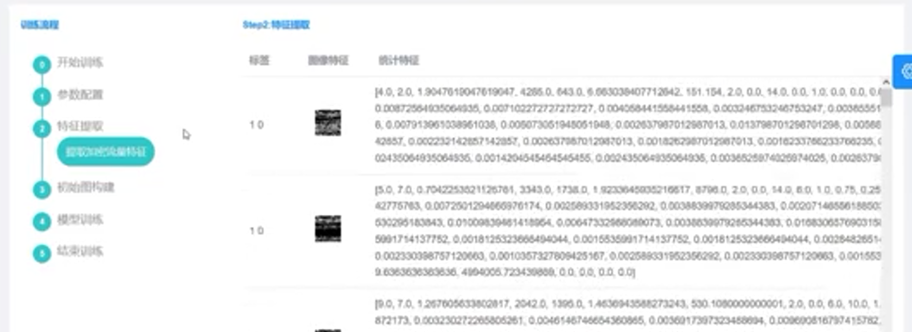
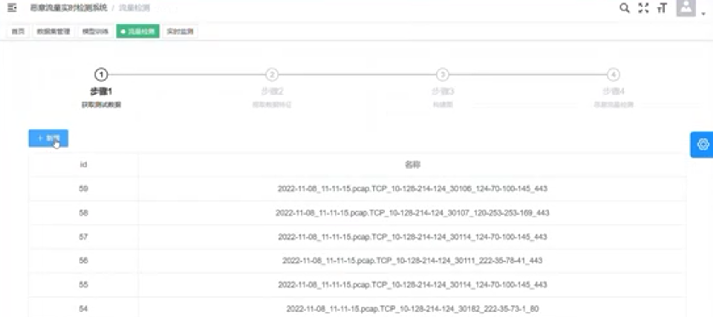
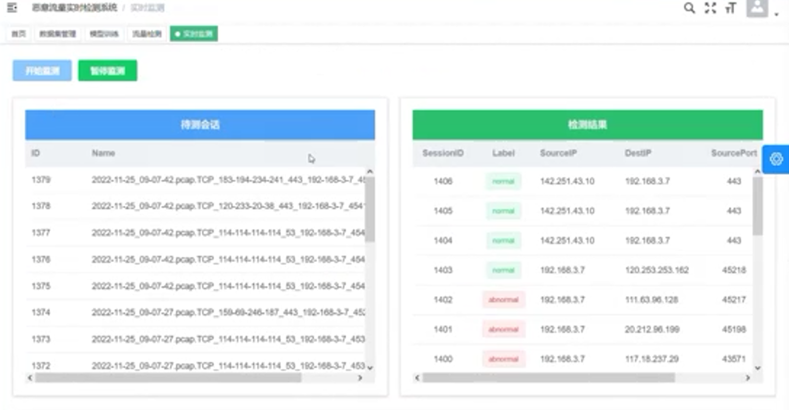
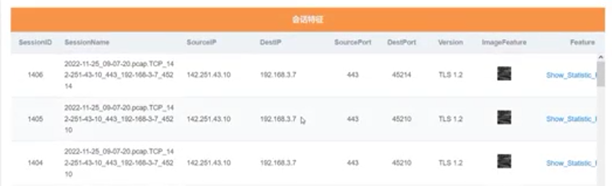

### 首页

- 加密流量图：红蓝点图
- 攻击者IP分布、被攻击者IP分布、被攻击者端口分布（饼图）
- 模型历史数据统计：模型损失、模型准确率（曲线图）

### 数据集管理

- 流量数据展示：包括流量四元组，TLS版本、图像、TLS握手信息、统计向量特征、标签

- 左上角功能：添加、删除、搜索（条件搜索）

### 模型训练

- 进度和参数设置
- 训练流程：开始训练→参数配置→特征提取→初始图构建→模型训练→结束训练（在模型训练时动态展示流量从混合到分开的过程）

### 流量检测

- 用户上传pcap包

### 实时监测

- 实时网卡捕获流量

- 会话特征

